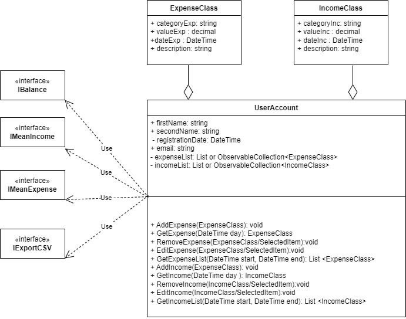

# BudgetManger4U
Matriculation No.: 65368, ...  
Modul: SWE

## Description
This is a budget planner for the module "Softwareentwicklung 2024". 
 

## Structure
The structure of the proposed app is presented on the UML diagram.
 
 

 
## Functionality
This app will help you not only to track your cashflow by registering expenses and income, but also provide with some basic statistical summary.
Furthermore, it enables the export of the data in csv for further processing and compatibility with other software solutions.
